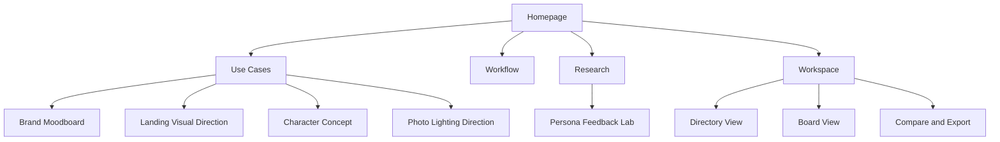

# Inspodex 방향성 진단 및 사이트 구조 재설계안

기준일: 2026-04-12

이 문서는 `product-strategy-session`과 `site-architecture` 관점을 기준으로 현재 `Inspodex`를 다시 진단하고, 향후 제품 방향과 사이트 구조를 하나의 흐름으로 정리한 문서다.

## 1. 핵심 결론

현재 `Inspodex`의 가장 강한 정체성은 `넓은 레퍼런스 아카이브`가 아니라 `비주얼 방향을 압축하는 개인 작업용 워크스페이스`다.

지금 사이트는 이미 메시지 면에서는 그 방향으로 이동하고 있다. 하지만 실제 정보구조와 첫 사용자 경험은 아직 `대규모 디렉토리 탐색 앱`에 더 가깝다. 즉, 전략은 앞서가고 있고 구조는 그 전략을 아직 충분히 따라오지 못한 상태다.

따라서 다음 단계의 핵심은 기능을 더 많이 붙이는 것이 아니라 아래 두 가지를 맞추는 것이다.

- 누구를 위한 서비스인지 더 선명하게 보이게 할 것
- 그 사용자가 가장 먼저 해야 할 행동을 더 쉽게 만들 것

한 문장으로 정리하면:

> Inspodex는 카테고리 중심 사이트가 아니라, 작업 결과 중심 사이트로 재구성되어야 한다.

## 2. 전략 컨텍스트

### 추천 타겟 사용자

- AI 시안 작업을 자주 하는 1인 크리에이터
- 프리랜서 브랜드 디자이너
- 빠르게 무드보드와 방향안을 정리해야 하는 UI/프로덕트 디자이너
- 제안서, 랜딩, 키비주얼 방향을 혼자 빠르게 잡아야 하는 1인 스튜디오

### 핵심 Job To Be Done

> 막연한 비주얼 방향을 10분 안에 저장 가능한 레퍼런스 보드와 실행 가능한 프롬프트/검색 팩으로 바꿔주기

### 지금 이 서비스가 풀어야 하는 문제

사용자는 좋은 레퍼런스를 많이 보는 것 자체보다, 빠르게 방향을 정하고 다음 작업으로 넘어가는 것을 원한다.

현재 작업자는 보통 아래 흐름을 반복한다.

1. 참고할 스타일을 찾는다
2. 비슷한 레퍼런스를 여러 사이트에서 더 모은다
3. 머릿속으로 조합해 방향을 정한다
4. 다시 프롬프트나 검색어를 손으로 만든다

`Inspodex`의 기회는 이 중간 단계를 한 화면 안에 압축하는 데 있다.

## 3. 현재 사이트 진단

### 잘하고 있는 점

- 레퍼런스 데이터 폭이 넓다
- 디렉토리별 탐색 진입이 빠르다
- 외부 검색 확장 흐름이 명확하다
- 최근 추가된 `보드 -> 비교 -> Export` 방향은 제품 전략과 잘 맞는다
- 메인 카피는 이제 `workspace` 방향을 어느 정도 설명하고 있다

### 현재 가장 큰 구조적 문제

#### 1. 제품 메시지와 실제 첫 화면 경험 사이에 간극이 있다

첫 화면은 `비주얼 방향을 압축하는 워크스페이스`를 말하고 있지만, 사용자가 곧바로 마주하는 것은 여전히 대량의 디렉토리와 필터다.

즉, 사용자는 결과보다 도구부터 배워야 한다.

#### 2. 첫 사용자에게는 "무엇을 하러 왔는지"보다 "어떤 카테고리가 있는지"가 먼저 보인다

이 구조는 익숙한 사용자에게는 괜찮지만, 처음 온 사용자에게는 인지 부담이 크다.

#### 3. 현재 사이트는 마케팅 사이트와 앱 워크스페이스가 한 페이지에 섞여 있다

이 방식은 초기에는 빠르지만, 메시지와 사용 흐름이 자주 충돌한다.

- 마케팅은 결과와 신뢰를 먼저 보여줘야 한다
- 앱은 속도와 조작 효율을 먼저 보여줘야 한다

지금은 두 역할이 한 화면에서 동시에 일어나고 있다.

#### 4. 보조 페이지의 역할 구분이 약하다

`persona-feedback.html`은 의미 있는 리서치 자산이지만, 현재는 제품 가치 증명과 리서치 아카이브의 중간 상태다. 좋은 자료이지만 메인 제품 흐름과의 연결 목적이 명확하게 보이지 않는다.

#### 5. 내부 문서와 외부 설명은 계속 동기화되어야 한다

이번 정리에서 [README.md](/Users/macmini/Vibecoding/inspodex/README.md#L1)는 현재 `workspace` 방향에 맞게 갱신했다. 다만 이후에도 제품 전략 문서, 배포 설명, 메인 카피가 같은 기준을 유지하도록 계속 묶어서 관리해야 한다.

## 4. 방향성 제안

### 제품 역할

현재 단계의 `Inspodex`는 아래 역할에 집중하는 것이 가장 적합하다.

> 흩어진 레퍼런스를 작업 가능한 방향 세트로 압축하는 도구

즉, 서비스의 중심은 `많은 레퍼런스`가 아니라 `더 빨리 방향을 정하게 해주는 구조`여야 한다.

### 사이트 역할

사이트는 두 가지 역할을 분리해서 가져가는 것이 좋다.

- `Landing`: 이 도구로 어떤 결과를 얻는지 보여주는 역할
- `Workspace`: 실제로 찾고, 저장하고, 비교하고, Export하는 역할

당장은 정적 구조를 유지하더라도 경험 설계는 이 두 역할을 분리해 생각하는 것이 중요하다.

### 메인 사용자 여정

권장하는 기본 여정은 아래다.

1. 사용자가 어떤 결과를 만들 수 있는지 이해한다
2. 자기 작업과 맞는 유스케이스를 고른다
3. 해당 유스케이스에 맞는 디렉토리/보드로 진입한다
4. 보드에 저장하며 방향을 압축한다
5. 비교와 Export로 다음 작업으로 넘어간다

핵심은 `카테고리 탐색`이 첫 단계가 아니라 `작업 의도 선택`의 뒤에 와야 한다는 점이다.

## 5. 추천 사이트 구조

### 권장 사이트 타입

`Hybrid SaaS + workspace site`

즉, 하나의 정적 앱이 아니라 아래 두 층을 가진 구조로 재정의한다.

- 제품 소개와 유스케이스를 설명하는 공개 레이어
- 실제 작업이 일어나는 앱 레이어

### 권장 페이지 계층

```text
Homepage (/)
├── Use Cases (/use-cases)
│   ├── Brand Moodboard (/use-cases/brand-moodboard)
│   ├── Landing Visual Direction (/use-cases/landing-visual-direction)
│   ├── Character Concept (/use-cases/character-concept)
│   └── Photo Lighting Direction (/use-cases/photo-lighting-direction)
├── Workflow (/workflow)
├── Research (/research)
│   └── Persona Feedback Lab (/research/persona-lab)
├── Workspace (/app)
│   ├── Design Directory (/app?dir=design)
│   ├── Character Directory (/app?dir=character)
│   ├── Board View (/app?view=boards)
│   └── Compare & Export (/app?view=board)
└── About / Changelog (optional, later)
```

### Mermaid 시각 구조



## 6. 내비게이션 원칙

### 헤더 내비게이션

헤더는 최대 5개 수준으로 유지한다.

- `Use Cases`
- `Workflow`
- `Research`
- `Open Workspace`

로고 클릭은 항상 홈으로 간다.

### CTA 구조

- 1차 CTA: `Open Workspace`
- 2차 CTA: `See Example Board` 또는 `Explore Use Cases`

현재처럼 `Pinterest 열기`가 상단 주요 액션에 있는 구조는 앱 내부에서는 유용할 수 있지만, 랜딩 최상단의 핵심 CTA로는 우선순위가 낮다.

### 보조 링크 정리

`Persona Lab`은 상단에 둘 수 있지만, 제품 핵심 CTA와 같은 무게로 놓기보다는 `Research`나 `Validation` 성격으로 재배치하는 편이 더 자연스럽다.

## 7. 페이지별 역할 정의

### Homepage

목표:

- 이 사이트가 어떤 문제를 해결하는지 빠르게 설명
- "카테고리가 많다"보다 "결과가 빨라진다"를 보여주기
- 유스케이스 기반 진입 제공

반드시 보여줘야 할 것:

- 한 줄 가치 제안
- 3단계 작업 흐름
- 실제 보드 결과 예시
- 대표 유스케이스 3~4개
- 작업 전후 차이

### Use Case Pages

목표:

- 사용자가 자기 작업과 맞는 입구를 찾게 하기
- 디렉토리 선택 부담을 줄이기

예시:

- 브랜드 무드보드용 레퍼런스 탐색
- 랜딩 시안용 비주얼 디렉션
- 캐릭터 콘셉트 탐색
- 사진/라이팅 레퍼런스 정리

### Workflow Page

목표:

- `Explore -> Save -> Compare -> Export`가 실제로 어떻게 이어지는지 보여주기
- 첫 사용자가 기능을 배우기 전에 흐름을 이해하게 만들기

### Research Page

목표:

- 제품이 감으로만 만들어진 것이 아니라 검증을 향해 가고 있음을 보여주기
- `persona-feedback.html` 같은 자산을 신뢰 요소로 활용하기

### Workspace

목표:

- 반복 사용자를 위한 가장 빠른 작업 표면 제공
- 보드 저장, 비교, Export를 앞쪽으로 끌어오기

권장 원칙:

- 진입 시 최근 보드 또는 대표 템플릿을 먼저 보여주기
- 그 다음 디렉토리 탐색으로 넘어가게 하기
- 처음부터 모든 필터를 전부 노출하지 않기

## 8. 우선순위 제안

### Now

- 랜딩과 워크스페이스의 역할을 분리해 설계하기
- 메인 진입에서 `유스케이스 선택 -> 워크스페이스 진입` 흐름 만들기
- `보드`를 탐색 결과물로 더 명확히 보여주기
- `README.md`, 배포 설명, 메인 카피가 같은 기준을 유지하도록 관리하기

### Next

- 유스케이스별 예시 보드 또는 템플릿 제공
- 최근 작업 복원과 보드 진입 경험 개선
- Compare / Export 결과를 예시 형태로 미리 보여주기
- `Research` 섹션 구조화

### Later

- 템플릿 라이브러리
- 공유 가능한 보드 링크
- 팀 피드백 흐름
- 충분한 데이터 구조가 쌓인 뒤 API 가능성 재검토

## 9. 당장 개발 또는 수정이 필요한 내용

### 1. 메인 진입을 카테고리 중심에서 작업 의도 중심으로 바꿔야 한다

현재는 디렉토리와 필터가 너무 빨리 등장한다. 첫 화면 아래에 `무엇을 만들고 싶은가`를 먼저 고르게 만드는 유스케이스 입구가 필요하다.

### 2. 워크스페이스 진입 시 보드 중심 빈 상태를 보여줘야 한다

현재는 검색 패널이 먼저 강하게 보인다. 하지만 반복 사용성을 키우려면 `최근 보드`, `새 보드 만들기`, `예시 보드로 시작`이 앞에 와야 한다.

### 3. `Persona Lab`의 위치와 목적을 재정의해야 한다

지금 페이지 자체는 좋다. 다만 이 페이지는 메인 제품 기능이 아니라 `리서치/검증 레이어`에 가깝다. 이름, 위치, 링크 맥락을 그 역할에 맞게 분리하는 것이 좋다.

### 4. 랜딩 상단 CTA 우선순위를 다시 정리해야 한다

현재는 `Pinterest 열기`가 상단에 보이는데, 제품의 핵심 행동보다 외부 이탈을 먼저 만들 수 있다. 이 버튼은 워크스페이스 내부의 보조 액션으로 내리는 편이 더 적절하다.

### 5. 제품 설명 문서를 계속 같은 방향으로 유지해야 한다

[README.md](/Users/macmini/Vibecoding/inspodex/README.md#L1)는 이번 정리에서 현재 방향에 맞게 갱신했다. 이후에도 배포 설명, 소개 문구, 문서가 모두 `visual reference workspace` 기준으로 함께 움직여야 한다.

## 10. 추천 지표

방향성 검증은 아래 지표로 보는 것이 좋다.

- 홈페이지에서 워크스페이스 진입률
- 유스케이스 선택률
- 첫 보드 생성률
- 첫 저장 카드 수
- Compare 사용률
- Export 사용률
- 7일 내 보드 재오픈 비율

## 11. 최종 권고

지금 `Inspodex`가 해야 할 일은 카테고리를 더 늘리는 것이 아니라, 이미 가진 폭을 `작업 흐름`으로 해석되게 만드는 것이다.

따라서 다음 제품/디자인 단계의 기준은 아래 하나로 잡는 것이 좋다.

> 사용자가 더 많은 것을 보게 하는가가 아니라, 더 빨리 방향을 정하게 하는가

이 기준에 맞으면 기능을 추가하고, 맞지 않으면 보류하는 것이 현재 가장 좋은 제품 운영 원칙이다.
